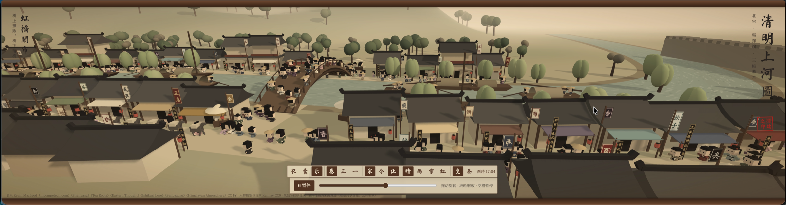

# 清明上河图 · 三维长卷



把张择端《清明上河图》做成可以走进去的 3D 汴京：长卷漫游、第三 / 第一人称行走、商铺客栈、换装、昼夜与天气、小偷与回合制战斗。单个 `index.html`，基于 Three.js 0.160（从 jsdelivr CDN 加载）。

## 运行

需要通过 HTTP 访问（直接双击打开会因跨域加载不了模型和音频）：

```bash
python3 -m http.server 8765 --bind 127.0.0.1
# 浏览器打开 http://127.0.0.1:8765/index.html
```

常用链接参数：`?view=third`（第三人称）、`&hour=21`（从晚上 9 点开始）、`&auto=0`（关闭自动天气）、`&thief=1`（两秒后刷一个小偷）。

## 操作

| 键 | 作用 |
|---|---|
| WASD / Shift | 走 / 跑 |
| 点击画面 + 移动鼠标 | 转镜头（Esc 释放） |
| V | 切换视角：长卷 / 第三人称 / 第一人称 |
| E / F | 进门、开箱 / 对话、坐下、睡觉 |
| B / I | 锦衣坊 / 行囊 |
| G / J（或左键） | 拿出兵器 / 出招 |
| 1–4、- / = | 天气、天气程度 |
| N | 跳到下一个黄昏 / 黎明 |
| M | 声音开关 |

## 素材与署名

- 音乐：Kevin MacLeod（incompetech.com）《Shenyang》《Tea Roots》《Eastern Thought》《Ishikari Lore》《Senbazuru》《Himalayan Atmosphere》，CC BY 许可
- 人物模型与音效：Kenney（kenney.nl），CC0，见 `models/Kenney-License.txt`、`audio/Kenney-License.txt`
- 室内挂画：宋代绘画真迹图像，来自维基共享资源，公有领域（来源见 `models/paintings/paintings.json`）
- 战鼓、风声、雷声等为 WebAudio 程序合成
